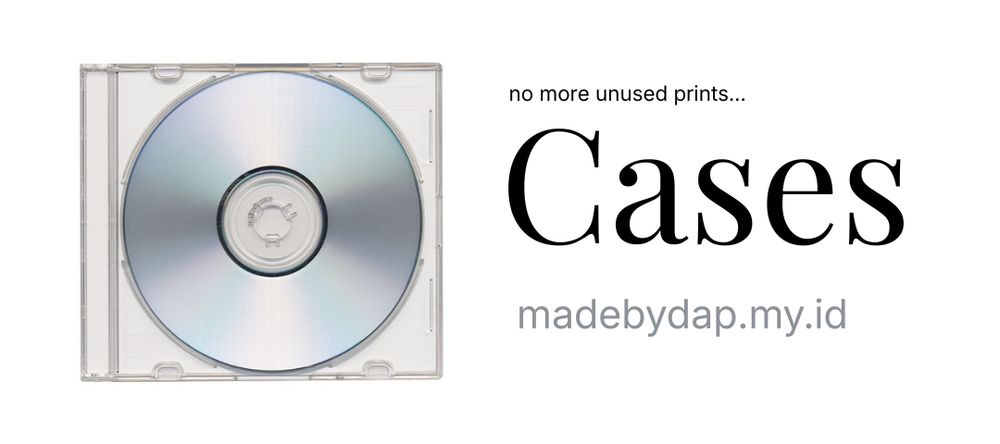

# CD Case Generator

<p align="center">
  
</p>

A web-based tool for creating printable CD jewel case covers. Upload your artwork, position it precisely, and export a print-ready PDF.

## Try It Now

[cases.madebydap.my.id](https://cases.madebydap.my.id)

## Features

- Front cover editor (4.75" x 4.75")
- Back tray editor with left spine, back center, and right spine
- Drag-to-reposition controls with boundary constraints
- Sync spines toggle to mirror left and right spine content
- High-resolution PDF export at 300 DPI
- Multiple paper sizes: A4, F4/Folio, Letter
- Fold guides for accurate cutting and folding

## Dimensions

| Part | Inches | Millimeters |
|------|--------|-------------|
| Front Cover | 4.75 x 4.75 | 120.7 x 120.7 |
| Back Center | 5.4 x 4.625 | 137.2 x 117.5 |
| Left/Right Spine | 0.25 x 4.625 | 6.4 x 117.5 |
| Full Tray | 5.9 x 4.625 | 149.9 x 117.5 |

## Tech Stack

- Vue 3 (Composition API)
- TypeScript
- Tailwind CSS v4
- Konva.js / vue-konva
- jsPDF

## Development

```bash
npm install
npm run dev
```

## Build

```bash
npm run build
```

## Usage

1. Upload images to the Front Cover and Back Tray sections
2. Drag images to reposition them within the boundaries
3. Enable "Sync Spines" to mirror content between left and right spines
4. Select a paper size and click "Download PDF"
5. Print the PDF and cut along the crop marks

## Future Plans

- Add more case styles (DVD, BluRay, even Cassettes)